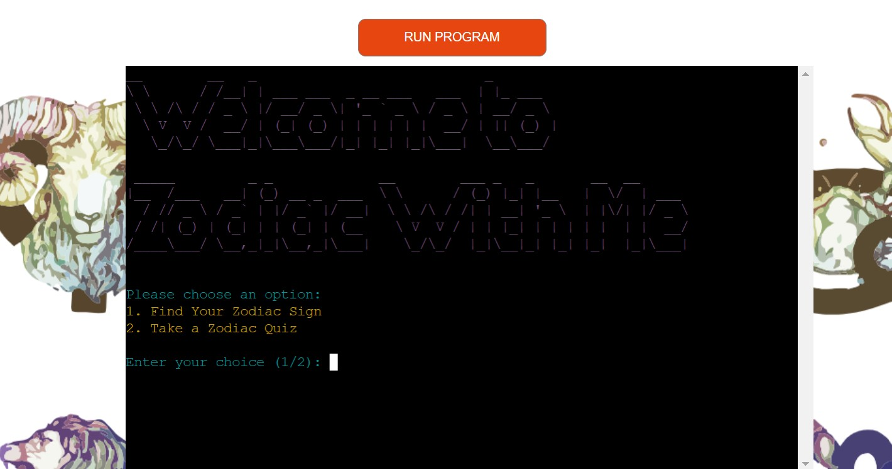
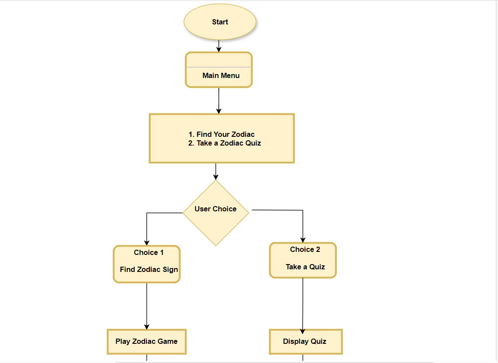
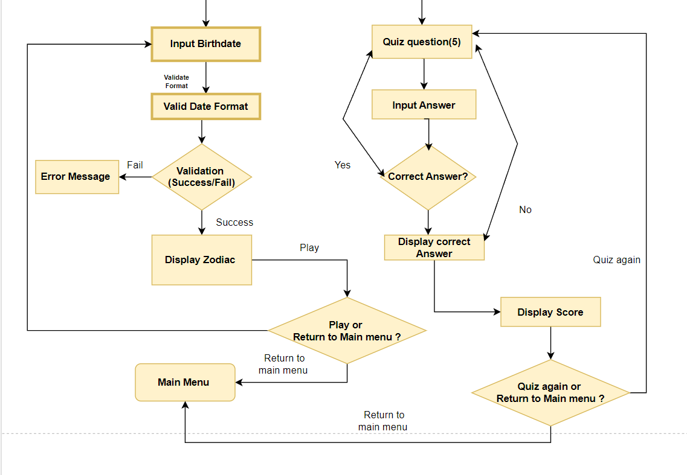
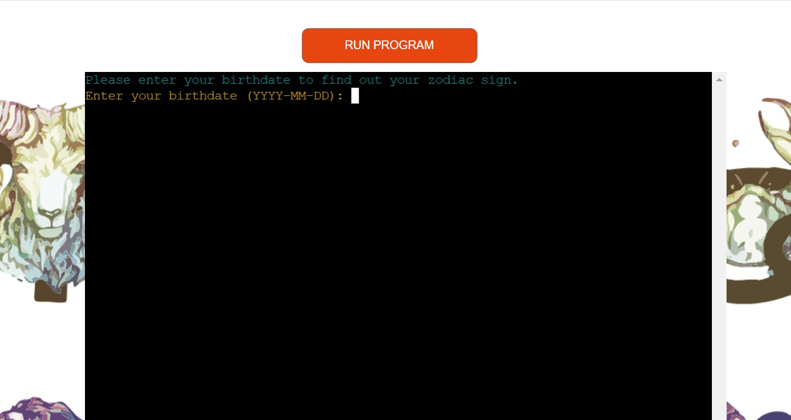
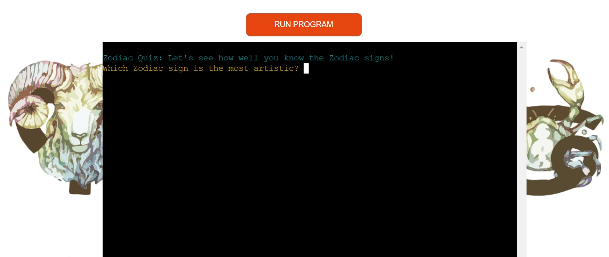

# **Zodiac With Me**

## **Overview**
Inspired by the joy of discovering new things with family, this Zodiac Game combines fun and learning about astrology. The game was brought to life with the encouragement of my Husband and Mom, who always enjoyed the playful side of Zodiac signs and their quirks. Their fascination with astrology and their love for quizzes provided the perfect blend of creativity and enthusiasm that shaped this project.
  
[Click here to be taken to the final deployment of the project.](https://projectwithme-a171b5a32073.herokuapp.com/)

## **Table of Contents** 
* [**Zodiac With ME**](#zodiac-with-me)
  * [**Overview**](#overview)
  * [**Table of Contents**](#table-of-contents)
  * [**The Game Flow:**](#the-game-flow)
    * [***Main Menu:***](#main-menu)
    * [***Finding Your Zodiac Sign:***](#finding-your-zodiac-sign)
    * [***Zodiac Quiz:***](#zodiac-quiz)
    * [***Loop and Retry Options:***](#loop-and-retry-options)
* [**Planning Phase:**](#planning-phase)
  * [***User Stories:***](#user-stories)
  * [***Site Aims:***](#site-aims)
  * [***How Will This Be Achieved:***](#how-will-this-be-achieved)
  * [***Game Flow Chart:***](#game-flow-chart)
* [**Features**](#features)
  * [**Welcome Screen:**](#welcome-screen)
    * [**Terminal Clearing:**](#terminal-clearing)
    * [**Zodiac Sign Determination:**](#zodiac-sign-determination)
    * [**Zodiac Interactive Quiz:**](#zodiac-interactive-quiz)
  * [**Once User Selected :**](#once-user-selected)
    * [**If The User Selects 1:**](#if-the-user-selects-1)
    * [**If The User Selects 2:**](#if-the-user-selects-2)
  * [**Styled Output:**](#styled-output)
  * [**Menu Navigation:**](#menu-navigation)
  * [**Error Handling:**](#error-handling)
  * [**Future-Enhancements**](#future-enhancements)
    * [***Graphical User Interface (GUI):***](#graphical-user-interface-(GUI))
    * [***Zodiac Personality Quiz:***](#zodiac-personality-quiz)
    * [***Daily/Monthly Horoscope:***](#daily/monthly-horoscope)
    * [***Extended Zodiac Information:***](#extended-zodiac-information)
    * [***Zodiac Sign Compatibility Checker:***](#zodiac-sign-compatibility-checker)
    * [***User Profiles:***](#user-profiles)
    * [***Leaderboards for Quiz:***](#leaderboards-for-quiz)
    * [***Multilingual Support:***](#multilingual-support)
    * [***More Advanced Zodiac Quizzes:***](#more-advanced-zodiac-quizzes)
    * [***Astrological Birth Chart Calculator:***](#astrological-birth-chart-calculator)
    * [***Personalized Daily Reminders:***](#personalized-daily-reminders)
    * [***Astrology Learning Resources:***](#astrology-learning-resources)
    * [***Social Media Integration:***](#social-media-integration)
    * [***Sound Effects and Music:***](#sound-effects-and-music)
    * [***Mobile App Conversion:***](#mobile-app-conversion)
* [**Testing Phase**](#testing-phase)
* [**Libraries**](#libraries)
    * [***os:***](#os)
    * [***sys:***](#sys)
    * [***random:***](#random)
    * [***datetime:***](#datetime)
    * [***pyfiglet:***](#pyfiglet)
    * [***colorama:***](#colorama)
* [**Deployment**](#deployment)
  * [***Playing on a Local machine or via Gitpod Terminal:***](#playing-on-a-local-machine-or-via-gitpod-terminal)
  * [***Final Deployment to Heroku:***](#final-deployment-to-heroku)
* [**Honorable Mentions**](#honorable-mentions)
* [**Credits**](#credits)

## **The Game Flow**

### ***Main Menu:***  

The user is welcomed with a colorful ASCII banner and given two options:
1. Find Your Zodiac Sign
2. Take a Zodiac Quiz

### ***Finding Your Zodiac Sign:***  

* The user inputs their birthdate in the 'YYYY-MM-DD' format.
* The program determines their Zodiac sign based on their birthdate.
* It then displays the Zodiac sign along with a description of its traits.
* Afterward, the user can choose to either play again or return to the main menu.

## ***Zodiac Quiz:***

* The user is presented with a quiz about Zodiac signs, featuring five randomly selected questions from a predefined set.
* Each correct answer adds to the user's score.
* At the end of the quiz, the user's score is displayed, and they can choose to either take the quiz again or return to the main menu.
  
## ***Loop and Retry Options:***

* Both the Zodiac sign game and the quiz offer retry options, allowing the user to either play again or return to the main menu.
* The user is prompted to enter valid responses if their input is invalid.

# **Planning Phase:**
## ***User Stories:***
As a user interested in astrology,
I want to:
* Discover My Zodiac Sign: Input my birthdate in a user-friendly format.
Receive a clear description of my Zodiac sign based on the date I provide.
* Take a Zodiac Quiz: Answer randomly selected questions about Zodiac signs. Get immediate feedback on my answers with a score at the end.
* Navigate the Game Easily: Choose between finding my Zodiac sign or taking the quiz from the main menu. Opt to play again or return to the main menu after completing a game or quiz.

## ***Site Aims:***
The site aims to:
1. Provide an Engaging User Experience
* Objective: Create an interactive and enjoyable experience for users interested in astrology.
* Goal: Offer a user-friendly interface where users can easily navigate between discovering their Zodiac sign and taking a quiz about Zodiac signs.
2. Educate Users About Zodiac Signs
* Objective: Inform users about different Zodiac signs and their characteristics.
* Goal: Provide accurate and concise descriptions of Zodiac signs based on user input, enhancing their understanding of astrology.
3. Test and Enhance Knowledge
* Objective: Challenge users with a quiz to test their knowledge of Zodiac signs.
* Goal: Present a variety of questions about Zodiac traits, offering immediate feedback and a score to reflect their knowledge level.
4. Ensure Accessibility and Usability
* Objective: Make the site accessible and easy to use for all users.
* Goal: Implement clear instructions, handle invalid inputs gracefully, and provide easy navigation options.
5. Encourage Re-engagement
* Objective: Motivate users to return and interact with the site again.
* Goal: Offer options to play the quiz again or explore other features, and ensure a smooth transition between different parts of the site.
6. Incorporate Personal Touches
* Objective: Reflect the personal inspirations behind the site’s design and functionality.
* Goal: Infuse the site with elements inspired by the user’s family, such as thoughtful details or themes that resonate with the user’s personal story.
  
## ***How Will This Be Achieved:***
To achieve the above, the site will:
* Engaging User Experience: Creating an interactive and visually appealing interface with intuitive navigation and immediate feedback.

* Education: Providing detailed Zodiac sign descriptions and quiz questions to enhance users' knowledge.

* Knowledge Testing: Using varied questions and instant feedback to assess and improve users' understanding of Zodiac signs.

* Accessibility: Ensuring robust error handling and responsive design for a seamless experience across devices.

* Re-engagement: Offering replay options and personalized features to encourage users to return and explore more.

* Personal Touch: Reflecting personal inspirations and stories in the game’s design and content to enhance connection and engagement.

## ***Game Flow Chart:***
To understand the steps required in order to program the game, I created the below flowchart using [lucid charts](https://www.draw.io/).  

## **Welcome Screen:**
From the welcome screen, the user has access to two things: -
* Find Your Zodiac Sign
* Take a Zodiac Quiz  
  

### **Terminal Clearing:**
Clears the terminal screen to enhance user experience.

### **Zodiac Sign Determination:**
* Allows users to find their Zodiac sign based on their birthdate.
* Provides a brief description of each Zodiac sign

### **Zodiac Interactive Quiz:**
* Presents a quiz with 5 randomly selected questions about Zodiac signs.
* Provides feedback on correct and incorrect answers.
* Displays the user's score at the end of the quiz.

## **Once User Selected:**

### **If The User Selects 1:**
### The `zodiac_game()` Function

1. **The function is called.**
2. **Inside `zodiac_game()`:**
   - The terminal screen is cleared.
   - The user is prompted to enter their birthdate in the format `YYYY-MM-DD`.
   - The program attempts to parse the entered birthdate using the `datetime` module.

3. **If the input is invalid:**
   - The user is asked whether they want to retry or return to the main menu.

4. **If the input is valid:**
   - The birthdate is used to extract the day and month.

5. **The user's Zodiac sign is determined** based on the birthdate using the `get_zodiac_sign()` function.

6. **The sign and its description are displayed.**

7. **The user is prompted to either:**
   - Play again, in which case `zodiac_game()` is called again.
   - Return to the main menu, in which case `main_menu()` is called.

### **If The User Selects 2:**
### The `zodiac_quiz()` Function

1. **The function is called.**
2. **Inside `zodiac_quiz()`:**
   - The terminal screen is cleared.
   - The user is informed that they are about to start a Zodiac quiz.
   - Five random questions about Zodiac signs are selected from a predefined list.

3. **For each selected question:**
   - The user is prompted to answer.
   - If the answer is correct, they receive positive feedback and their score is incremented.
   - If the answer is incorrect, the correct answer is displayed.

4. **After answering all five questions:**
   - The user's score is displayed.

5. **The user is prompted to either:**
   - Take the quiz again, in which case `zodiac_quiz()` is called again.
   - Return to the main menu, in which case `main_menu()` is called.

### **Styled Output:**
* Uses colorama to add colors to terminal output for better readability.
* Includes ASCII art generated by pyfiglet for a welcoming main menu screen.

### **Menu Navigation:**
* Main menu offers choices to find the Zodiac sign or take the quiz.
* Handles user choices and navigates to the appropriate function.

### **Error Handling:**
* Manages various errors such as invalid date formats and blank inputs.
* Provides clear instructions for users to correct their input.

## **Future-Enhancements**

### **Graphical User Interface (GUI)**:
  - Replacing the command-line interface with a graphical interface using libraries like Tkinter or PyQt.
  - Utilizing buttons, drop-down menus, and visual elements for a more interactive user experience.

### **Zodiac Personality Quiz**:
  - Implementing a personality quiz that matches users to their Zodiac sign based on traits, rather than their birthdate.
  - Asking questions about habits, preferences, and personal traits for a fun, engaging experience.

### **Daily/Monthly Horoscope**:
  - Adding daily or monthly horoscope features by integrating an API or scraping horoscope data from reliable sources.

### **Extended Zodiac Information**:
  - Providing additional insights like compatibility, famous personalities, lucky numbers, ruling planets, and gemstones for each Zodiac sign.

### **Zodiac Compatibility Checker**:
  - Allowing users to input two birthdates to check compatibility between Zodiac signs, useful for friendships or romantic relationships.

### **User Profiles**:
  - Adding a feature where users can save their birthdate, quiz scores, and preferences, stored locally or in a database for personalized content.

### **Quiz Leaderboards**:
  - Implementing a leaderboard to track top quiz scores, either locally or online, for competitive play.

### **Multilingual Support**:
  - Adding support for multiple languages, enabling a broader global reach using libraries like gettext.

### **Advanced Zodiac Quizzes**:
  - Creating more detailed quizzes with advanced questions about astrology, including planets and houses, and add time limits for a competitive edge.

### **Astrological Birth Chart Calculator**:
  - Adding a feature to calculate users’ full birth chart, including sun, moon, and rising signs, based on their birth date, time, and location.

### **Personalized Daily Reminders**:
  - Implementing daily notifications for horoscopes or astrological tips via email, SMS, or in-app notifications.

### **Astrology Learning Resources**:
  - Providing articles or learning resources about Zodiac signs, planets, and other astrology terms to educate users.

### **Social Media Integration**:
  - Adding features to share Zodiac signs, quiz results, or horoscopes on social platforms like Twitter, Instagram, or Facebook.

### **Sound Effects and Music**:
  - Introducing sound effects for correct answers, background music for immersive gameplay, and Zodiac sign reveals.

### **Mobile App Conversion**:
  - Converting the program into a mobile app using frameworks like Kivy or React Native, allowing users to engage with it on-the-go.

# **Testing Phase**
I have included details of testing both during development and post development in a separate document called [TESTING.md](TESTING.md).

# **Libraries**
Few important Libraries Used in *Zodiac With Me*:

### ***os***:
  - Used to determine the operating system and clear the terminal screen using the appropriate command (`cls` for Windows ).

### ***sys***:
  - Provides access to system-specific parameters and functions. Although it's imported, this library is not directly used in the current code.

### ***random***:
  - Used to randomly select questions in the Zodiac quiz to ensure variability and unpredictability.

### ***datetime***:
  - Used to handle date and time operations, specifically for parsing the user's birthdate and determining their Zodiac sign based on their birth month and day.

### ***pyfiglet***:
  - Used to generate ASCII art for the welcome banner ("Welcome to Zodiac With Me"). This adds a visually appealing element to the text-based user interface.

### ***colorama***:
  - Used to provide color support for the terminal text. It allows for the display of colorful output, making the user interface more engaging. It includes:
    - `Fore`: To color text (e.g., `Fore.CYAN`, `Fore.YELLOW`).
    - `Style`: To reset or modify text styles (e.g., `Style.RESET_ALL` to reset text color).
    - `init()`: Initializes the color support, ensuring compatibility across platforms like Windows.

# **Deployment**

## ***Playing on a Local machine or via Gitpod Terminal:***
This project was developed by forking a [specialized Code Institute template](https://github.com/Code-Institute-Org/p3-template) which simulates a terminal in the web browser. Due to this, I optimized the game to work via the [final Heroku deployment](https://projectwithme-a171b5a32073.herokuapp.com/), and I do not recommend playing it locally. 

## ***Final Deployment to Heroku:***  
  
The project was deployed to [Heroku](https://www.heroku.com) using the below procedure:-    
  
1. **Log in to Heroku** or create an account if required.
1. **click** the button labeled **New** from the dashboard in the top right corner, just below the header.
1. From the drop-down menu **select "Create new app"**.
1. **Enter a unique app name**. I combined my GitHub user name and the game's name with a dash between them (dnlbowers-battleship) for this project.
1. Once the web portal shows the green tick to confirm the name is original **select the relevant region.** In my case, I chose Europe as I am in Malta.
1.  When happy with your choice of name and that the correct region is selected, **click** on the **"Create app" button**.
1. This will bring you to the project "Deploy" tab. From here, navigate to the **settings tab** and scroll down to the **"Config Vars" section**. 
1. **Click** the button labelled **"Reveal Config Vars"** and **enter** the **"key" as port**, the **"value" as 8000** and **click** the **"add"** button.
1. Scroll down to the **buildpacks section of the settings page** and click the button labeled **" add buildpack," select "Python," and click "Save Changes"**.
1. **Repeat step 11 but** this time **add "node.js" instead of python**. 
   * ***IMPORTANT*** The buildpacks must be in the correct order. If node.js is listed first under this section, you can click on python and drag it upwards to change it to the first buildpack in the list.
1. Scroll back to the top of the settings page, and **navigate to the "Deploy" tab.**
1. From the deploy tab **select Github as the deployment method**.
1. **Confirm** you want to **connect to GitHub**.
1. **Search** for the **repository name** and **click** the **connect** button next to the intended repository.
1. From the bottom of the deploy page **select your preferred deployment type** by follow one of the below steps:  
   * Clicking either "Enable Automatic Deploys" for automatic deployment when you push updates to Github.  
   * Select the correct branch for deployment from the drop-down menu and click the "Deploy Branch" button for manual deployment. 

# **Honorable Mentions**
* [David Bowers](https://github.com/dnlbowers) for inspiring me with his 3rd Portfolio Project: [Battleships](https://dnlbowers-battleship.herokuapp.com/) . My fantastic mentor at Code Institute, thank you for your support, feedback, bug testing and great human.
* Lewis my Cohort Facilitator helped me in revewing the project and also helped me with the idea.
* The Code Institute Slack community as a whole who tested and supported throughout.  
* And the **biggest thanks goes to** my Husband and my boys, who have had to deal with me face to face through it all. 

# **Credits**
* Python OOP Tutorial series by Corey Schafer for general reference on working with classes and OOP in general  - [First of six videos in the series](https://youtu.be/ZDa-Z5JzLYM)  
* To get a general idea of the game logic, I used this video on the [Devpost Youtube channel](https://youtu.be/zSQIGzmcp2I)  
* The idea to decorate the board with numbers above and to the side came from [Knowledge Mavens youtube channel](https://youtu.be/alJH_c9t4zw)
* Clear console function copied from [delftstack.com](https://www.delftstack.com/howto/python/python-clear-console/)
* How to make a pause for a key to be pressed I referenced from [pretagteam.com](https://pretagteam.com/question/python-press-any-key-to-exit)
* [draw.io](https://www.draw.io/) was used to create the game flow chart "flowchart.jpeg"
* [Draw.io](https://app.diagrams.net/) was used to create the setup of objects diagram "Zodiac-With-Me.png"
* [Code Institute](https://codeinstitute.net/) for providing the template. The [template](https://github.com/Code-Institute-Org/p3-template) gave me a mock terminal to display my game via a webpage.
* [ASCII Art text generator](http://www.network-science.de/ascii/) used for the welcome screen text.
* Favicon image taken from [pixabay](https://pixabay.com/photos/battleship-us-navy-broadside-firing-79519/) under Pixabay License, Free for commercial use, No attribution required however the user who posted the image was "12019 / 10259 images" 
* Background image was downloaded from [stock.adobe.com](https://stock.adobe.com/mt/Library/urn:aaid:sc:EU:7b501d7b-97a5-4e2a-8638-7d43341ae21b?asset_id=176108523) under the [standard license](https://stock.adobe.com/mt/license-terms)
* [stack overflow]() was used to resolve the [HTML error found by the validator](https://stackoverflow.com/questions/12150369/define-multiple-languages-in-html-root-elements-lang-attribute) and to find the [string library](https://stackoverflow.com/questions/1549641/how-can-i-capitalize-the-first-letter-of-each-word-in-a-string) to ensure the player name always showed with a capital at the start of each name entered.

[Back to top](#contents)
