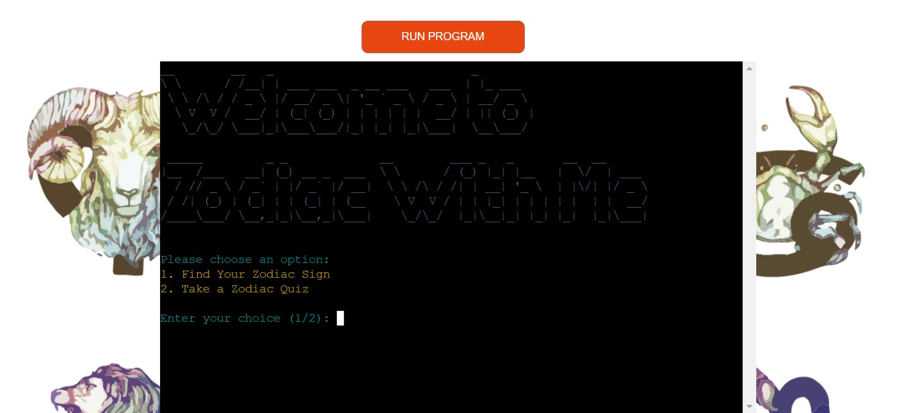

# **Zodiac With Me**

## **Overview**
Inspired by the joy of discovering new things with family, this Zodiac Game combines fun and learning about astrology. The game was brought to life with the encouragement of my Husband and Mom, who always enjoyed the playful side of Zodiac signs and their quirks. Their fascination with astrology and their love for quizzes provided the perfect blend of creativity and enthusiasm that shaped this project.
  
[Click here to be taken to the final deployment of the project.](https://projectwithme-a171b5a32073.herokuapp.com/)

## **Table of Contents** 
* [**Zodiac With ME**](#zodiac-with-me)
  * [**Overview**](#overview)
  * [**Table of Contents**](#table-of-contents)
  * [**The Game Flow:**](#the-game-flow)
    * [***Main Menu:***](#main-menu)
    * [***Finding Your Zodiac Sign:***](#finding-your-zodiac-sign)
    * [***Zodiac Quiz:***](#zodiac-quiz)
    * [***Loop and Retry Options:***](#loop-and-retry-options)
* [**Planning Phase:**](#planning-phase)
  * [***User Stories:***](#user-stories)
  * [***Site Aims:***](#site-aims)
  * [***How Will This Be Achieved:***](#how-will-this-be-achieved)
  * [***Game Flow Chart:***](#game-flow-chart)
* [**Features**](#features)
  * [**Welcome Screen:**](#welcome-screen)
    * [**Terminal Clearing:**](#terminal-clearing)
    * [**Zodiac Sign Determination:**](#zodiac-sign-determination)
    * [**Zodiac Interactive Quiz:**](#zodiac-interactive-quiz)
  * [**Once User Selected :**](#once-user-selected)
    * [**User Input Validation:**](#player-name-input-with-error-handling)
    * [**Replay and Menu Options:**](#replay-and-menu-options)
  * [**Styled Output:**](#styled-output)
  * [**Menu Navigation:**](#menu-navigation)
  * [**Error Handling:**](#error-handling)
  * [**Future-Enhancements**](#future-enhancements)
    * [***Multiplayer:***](#multiplayer)
    * [***Improved AI Intelligence:***](#improved-ai-intelligence)
    * [***Improved Visuals:***](#improved-visuals)
    * [***Audio:***](#audio)
    * [***Randomize the Starting Player***](#randomize-the-starting-player)
* [**Testing Phase**](#testing-phase)
* [**Libraries**](#libraries)
    * [***random:***](#random)
    * [***os:***](#os)
    * [***getch:***](#getch)
    * [***string:***](#string)
* [**Deployment**](#deployment)
  * [***Playing on a Local machine or via Gitpod Terminal:***](#playing-on-a-local-machine-or-via-gitpod-terminal)
  * [***Final Deployment to Heroku:***](#final-deployment-to-heroku)
* [**Honorable Mentions**](#honorable-mentions)
* [**Credits**](#credits)

## **The Game Flow**

### ***Main Menu:***  

The user is welcomed with a colorful ASCII banner and given two options:
1. Find Your Zodiac Sign
2. Take a Zodiac Quiz

### ***Finding Your Zodiac Sign:***  

* The user inputs their birthdate in the 'YYYY-MM-DD' format.
* The program determines their Zodiac sign based on their birthdate.
* It then displays the Zodiac sign along with a description of its traits.
* Afterward, the user can choose to either play again or return to the main menu.

## ***Zodiac Quiz:***

* The user is presented with a quiz about Zodiac signs, featuring five randomly selected questions from a predefined set.
* Each correct answer adds to the user's score.
* At the end of the quiz, the user's score is displayed, and they can choose to either take the quiz again or return to the main menu.
  
## ***Loop and Retry Options:***

* Both the Zodiac sign game and the quiz offer retry options, allowing the user to either play again or return to the main menu.
* The user is prompted to enter valid responses if their input is invalid.

# **Planning Phase:**
## ***User Stories:***
As a user interested in astrology,
I want to:
* Discover My Zodiac Sign: Input my birthdate in a user-friendly format.
Receive a clear description of my Zodiac sign based on the date I provide.
* Take a Zodiac Quiz: Answer randomly selected questions about Zodiac signs. Get immediate feedback on my answers with a score at the end.
* Navigate the Game Easily: Choose between finding my Zodiac sign or taking the quiz from the main menu. Opt to play again or return to the main menu after completing a game or quiz.

## ***Site Aims:***
The site aims to:
1. Provide an Engaging User Experience
* Objective: Create an interactive and enjoyable experience for users interested in astrology.
* Goal: Offer a user-friendly interface where users can easily navigate between discovering their Zodiac sign and taking a quiz about Zodiac signs.
2. Educate Users About Zodiac Signs
* Objective: Inform users about different Zodiac signs and their characteristics.
* Goal: Provide accurate and concise descriptions of Zodiac signs based on user input, enhancing their understanding of astrology.
3. Test and Enhance Knowledge
* Objective: Challenge users with a quiz to test their knowledge of Zodiac signs.
* Goal: Present a variety of questions about Zodiac traits, offering immediate feedback and a score to reflect their knowledge level.
4. Ensure Accessibility and Usability
* Objective: Make the site accessible and easy to use for all users.
* Goal: Implement clear instructions, handle invalid inputs gracefully, and provide easy navigation options.
5. Encourage Re-engagement
* Objective: Motivate users to return and interact with the site again.
* Goal: Offer options to play the quiz again or explore other features, and ensure a smooth transition between different parts of the site.
6. Incorporate Personal Touches
* Objective: Reflect the personal inspirations behind the site’s design and functionality.
* Goal: Infuse the site with elements inspired by the user’s family, such as thoughtful details or themes that resonate with the user’s personal story.
  
## ***How Will This Be Achieved:***
To achieve the above, the site will:
* Engaging User Experience: Creating an interactive and visually appealing interface with intuitive navigation and immediate feedback.

* Education: Providing detailed Zodiac sign descriptions and quiz questions to enhance users' knowledge.

* Knowledge Testing: Using varied questions and instant feedback to assess and improve users' understanding of Zodiac signs.

* Accessibility: Ensuring robust error handling and responsive design for a seamless experience across devices.

* Re-engagement: Offering replay options and personalized features to encourage users to return and explore more.

* Personal Touch: Reflecting personal inspirations and stories in the game’s design and content to enhance connection and engagement.

## ***Game Flow Chart:***
To understand the steps required in order to program the game, I created the below flowchart using [lucid charts](https://www.draw.io/).  

 

## **Welcome Screen:**
From the welcome screen, the user has access to two things: -
* Find Your Zodiac Sign
* Take a Zodiac Quiz  
  

### **Terminal Clearing:**
Clears the terminal screen to enhance user experience.

### **Zodiac Sign Determination:**

