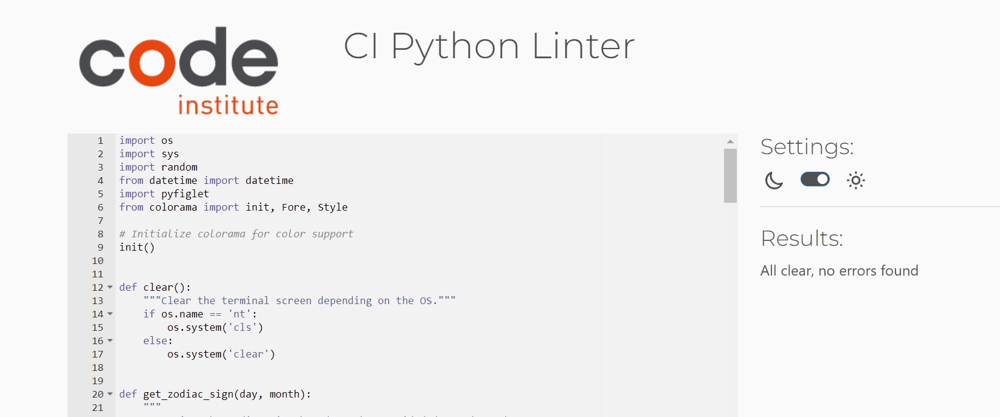

# **Testing**
## **Table of Contents:**
* [**Testing**](#testing)
  * [**Table of Contents:**](#table-of-contents)
  * [**Manual Testing:**](#manual-testing)
    * [***PEP8 Linter:***](#pep8-linter)
    * [***Inputs:***](#inputs)
    * [***Game Play:***](#game-play)
  * [**Bugs and Fixes**](#bugs-and-fixes)
    * [**Remaining Bugs**](#remaining-bugs)
  * [**Post Development Testing**](#post-development-testing)
    * [**Validators**](#validators)
    * [***Python:*** - http://pep8online.com/](#python---httppep8onlinecom)

## **Manual Testing:** 
I performed manual testing throughout this project in the following ways:
### ***PEP8 Linter:***
To begin with, I was using [autopep8 2.3.1]( https://pypi.org/project/autopep8/#installation ) to lint my code. 

A quick google search revealed the following console command "$ autopep8 --in-place --aggressive --aggressive run.py", and after executing this command, the function formatted my code perfectly in line with PEP8 coding conventions.

### ***Inputs:***
I have tested all inputs with strings where expecting integers, integers where expecting strings and adding spaces to the input value.  

Lastly, I challenged the slack community to break the app in any way possible which by the deployment of final product was not possible.   

### ***Game Play:***
Throughout development, I was testing the game in the terminal of VScode as well as several playing multiple rounds in the Code Institute terminal template for each deployment to Heroku.

The end result is a robust game which stays playing continuously without error.

## **Bugs and Fixes**
### 1. Issue: Hardcoded Zodiac Sign Logic
**Problem**:  
The Zodiac sign logic (date ranges and descriptions) was hardcoded in a flat manner, making the code less maintainable and prone to errors.

**Fix**:  
Refactored the zodiac sign logic into a `ZodiacSign` class where each sign is represented as an object. This allows for easier extension and modification of sign properties like date ranges or descriptions.
        
### 2. Issue: Quiz Logic and Validation
**Problem**:  
The quiz was using a list for questions, and user input was not validated correctly, which led to cases where users could enter blank or invalid answers.

**Fix**:  
Introduced a `Quiz` class to manage the quiz logic, and added input validation to ensure that users do not enter blank answers or invalid choices.

### 3. Issue: Date Validation in Zodiac Sign Finder

**Problem:**  
The code lacked proper date validation in the Zodiac sign finder, which could result in crashes when users entered invalid birthdates.

**Fix:**  
Added `try-except` blocks to handle invalid date formats when users input their birthdate. This allowed users to retry or return to the main menu if the input was invalid.

### 4. Issue: Unclear User Navigation in Menus

**Problem:**  
After completing a quiz or finding their zodiac sign, users were not given clear options on what to do next, causing confusion.

**Fix:**  
Implemented clear instructions and added options for users to either replay the game or return to the main menu after finishing a section (quiz or zodiac sign finder).

### 5. Issue: Line Length Exceeding PEP 8 Standards

**Problem:**  
Some lines exceeded the maximum recommended line length (79 characters), particularly in the zodiac sign definitions, leading to PEP 8 violations.

**Fix:**  
Broke down long lines into multiple lines to comply with PEP 8 guidelines (using proper indentation).

### 6. Issue: Limited User Feedback

**Problem:**  
After the user completed a quiz or found their zodiac sign, the feedback provided was minimal, leading to a less engaging user experience.

**Fix:**  
Enhanced feedback by providing detailed descriptions for zodiac signs and personalized feedback after the quiz, including the user’s score and a motivational message.

### 7. Issue: Lack of Replayability

**Problem:**  
Once a game or quiz was finished, the program did not smoothly allow users to replay or take another quiz without restarting the program.

**Fix:**  
Added logic to offer users the choice to replay the quiz or game or return to the main menu without restarting the entire program.

### 8. Issue: Blank Input Handling

**Problem:**  
In the quiz section, users could submit blank inputs, which were accepted without validation, making the user experience feel incomplete.

**Fix:**  
Added checks to ensure that blank or empty inputs are not accepted. If an empty answer is given, the user is prompted again.

### 9. Issue: No Exit Option in Main Menu

**Problem:**  
The main menu did not provide an option for users to exit the game, forcing them to manually close the program.

**Fix:**  
Added an exit option in the main menu to allow users to cleanly quit the game.

#### 10. Inconsistent Formatting of Zodiac Sign Descriptions
**Problem**:  
Zodiac sign descriptions were not consistently formatted, making them less readable and less professional.

**Fix**:  
Standardized the formatting of Zodiac sign descriptions to ensure consistency and improve readability.

#### 11. Lack of Error Handling for Unsupported Operating Systems
**Problem:**  
The code used `os.system('cls')` and `os.system('clear')` to clear the screen, which might not work on all systems, potentially causing errors on unsupported platforms.

**Fix:**  
Added error handling for unsupported operating systems and provided a fallback or warning message.

### **Remaining Bugs**
At the time of submission no bugs remained in the app.

## **Post Development Testing**
### **Validators**

#### ***Python:*** - http://pep8online.com/
* Due to the use of linters and the autopep8 terminal command referenced above, [PEP8online.com](http://pep8online.com/) returned no errors.

Various tests were carried out for this project.

NB - HTML, CSS, and JavaScript were provided in the [code institute template](https://github.com/Code-Institute-Org/p3-template) and are not in scope for this project as well as the aspect of responsive design, therefore they were not taken into consideration.

[return to README.md](README.md)